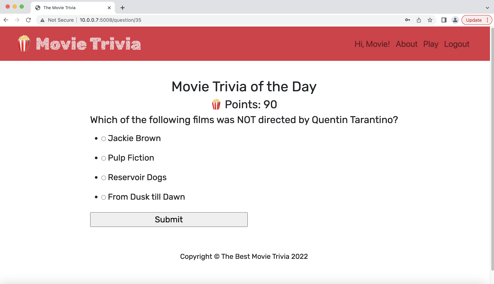

# The Best Movie Trivia Game 🎬
Do you want some popcorn? 🍿
Are you a movie buff?
[https://best-movie-trivia.herokuapp.com](https://best-movie-trivia.herokuapp.com/)



## Thought Process

I like to start by thinking about what information needs to be stored in the database.
The database holds valuable data and acts as the brain for the entire application which will lead the direction for the
rest of the code.

I know that I want different players stored in the database so that they can keep track of their 'popcorn points'.
Therefore, I need a `Player` table.

I want to be able to store all the data of the trivia questions such as the question, multiple choices, and
the correct answer. So I knew I need a `Question` table.

I want to be able to store the player's guess and result of each guess. So I knew I need a `Guess` table.

The tables are related to each other. Each Guess row is tied to a specific `question_id` from the `Question` table and
specific `player_id` in the `Player` table. The player's `points` on the `Player` table increases if the player answered
the question correctly, which is stored in the 'result' column of the 'Guess' table.


## Code Structure
Created a `TriviaQuestion Class` responsible for
* creating the movie trivia questions via open database api
* retrieving necessary info from the data

### 'Popcorn Points' Logic
1) Players are allowed to guess three (max_allowed) trivia questions each day.
2) If the players guessed the question correctly, they earn 10 popcorn points per question.

### Created RESTFUL API routes in the server
* `GET` `/play` --> responsible for displaying max_allowed trivia questions of the day
* `GET` `/question/< int:trivia_id>` --> get specific trivia_id
* `POST` `/question/< int:trivia_id>` --> retrieve's player's answer and compares it to the correct_answer
* `GET` `/goodbye` --> # shows that the Players have reached the max allowed trivia questions for the day and to return again tomorrow.
* `POST` `/register` --> register player
* `GET` `/login` --> login player
* `DELETE` `/logout` --> logout player

After most http requests from the frontend, the database gets updated and stores the new data in the respective tables.
The server then returns a response of all data needed to display in the frontend.

## How to run the code.

### 1. Database

For the purposes of this demo, a SQLite db file has already been created with sample data in `trivia-collection.db`

### 2. Environment Variables

The `.env` file stores the secret key and database url to protect the database and any other important information.

Place environment variables inside a file named `.env`

```
TRIVIA_SECRET_KEY=popcorn
TRIVIA_DATABASE_URL=sqlite:///trivia-collection.db
```


### 3. Install all necessary requirements.

I used the `flask` framework to develop the web application along with `sqlachemy` to communicate with the database.
I used `flask_login_manager` to help with user authentication.

Install the python dependencies

```sh
pip3 intall -r requirements.txt
```

### 4. Start the server

```sh
python3 main.py
```

### 5. Play the game

Open [http://127.0.0.1:5008](http://127.0.0.1:5008) in your browser


### TODO

* I want to add the ability for players to share their 'popcorn points' in social media
* I want to add the ability for players to redeem 'popcorn points' for rewards such as movie tickets, popcorn at the movie theater, etc.
